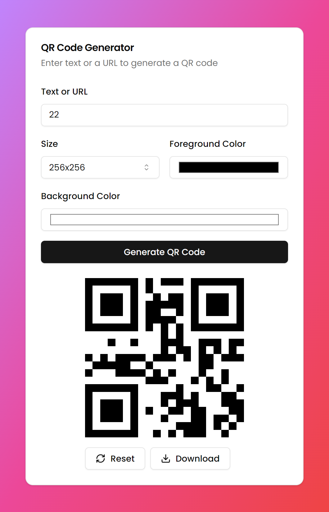

# qr-generator
qr-generator app in react + vite 
live preview https://qr-generator-pp31.vercel.app/

<h1 align="center">Hellooo, I'm <a href="https://elvisxd.github.io/webside-curriculum/">Elvis</a> 👋</h1>

## technologies 💻

 
<h3 align="center">Weather App</h3>

                                       

 

A simple and efficient QR Code Generator built with React and Vite. This application allows users to generate QR codes for any text or URL input. The generated QR codes can be easily downloaded and shared. The app features a clean and intuitive interface, making it user-friendly and accessible for everyone.

                                                             
</table>                                                                                 

